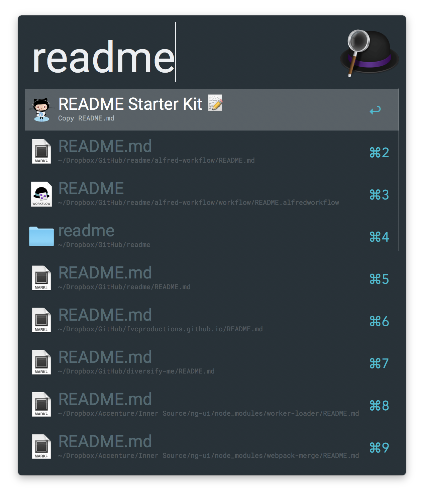

# alfred-readme

An [Alfred 3](https://www.alfredapp.com/) workflow that allows you to stress less on formatting a `README`. 📝

## Installation

Download this Alfred workflow from [Releases](https://github.com/fvcproductions/readme/releases).

## Usage

Activate this workflow by typing in `readme` into Alfred.

This workflow will copy [this README template](http://github.com/fvcproductions/readme) and notifies you that the starter README text was copied.

You can use your own `README` template by editing this workflow within your Alfred preferences.

## Credits

- [FVCproductions](https://github.com/fvcproductions) 🍓🍫

## Kudos

- GitHub secretary octocat was taken from the [GitHub Octodex](https://octodex.github.com/)